# 🎓 Smart University

## 📚 Plateforme intelligente de gestion universitaire

Smart University est une plateforme web moderne destinée à faciliter la gestion d'un établissement universitaire.

L'application permet de centraliser et de gérer les principales informations universitaires à travers une interface moderne, intuitive et responsive.

---

## 🚀 Fonctionnalités

### 🔐 Authentification
- Connexion administrateur
- Validation des identifiants
- Protection des routes avec `AuthGuard`
- Déconnexion
- Redirection automatique vers la page de connexion

### 📊 Tableau de bord
- Vue générale de l'université
- Statistiques principales
- Navigation rapide vers les différentes fonctionnalités

### 👨‍🎓 Gestion des étudiants
- Liste des étudiants
- Recherche
- Informations détaillées
- Ajout d'un étudiant
- Modification d'un étudiant
- Suppression d'un étudiant
- Gestion des statuts

### 👨‍🏫 Gestion des enseignants
- Liste des enseignants
- Informations des enseignants
- Gestion des enseignants

### 📚 Gestion des cours
- Gestion des cours
- Filières
- Niveaux
- Informations pédagogiques

### 🗓️ Gestion des emplois du temps
- Consultation des horaires
- Organisation des cours
- Gestion des programmes

### 📝 Gestion des notes
- Consultation des notes
- Gestion des résultats académiques

### 💳 Gestion des paiements
- Suivi des paiements
- Informations financières des étudiants

### 📖 Bibliothèque
- Gestion des ressources
- Consultation des documents

### 💬 Messagerie
- Gestion des messages
- Communication avec les utilisateurs

### 🔔 Notifications
- Notifications système
- Alertes importantes

### 👤 Profil
- Informations du profil administrateur

### ⚙️ Paramètres
- Gestion des paramètres de l'application

### 📋 Rapports
- Consultation des rapports
- Données administratives et académiques


---

## 📸 Captures d'écran

### 🔐 Page de connexion

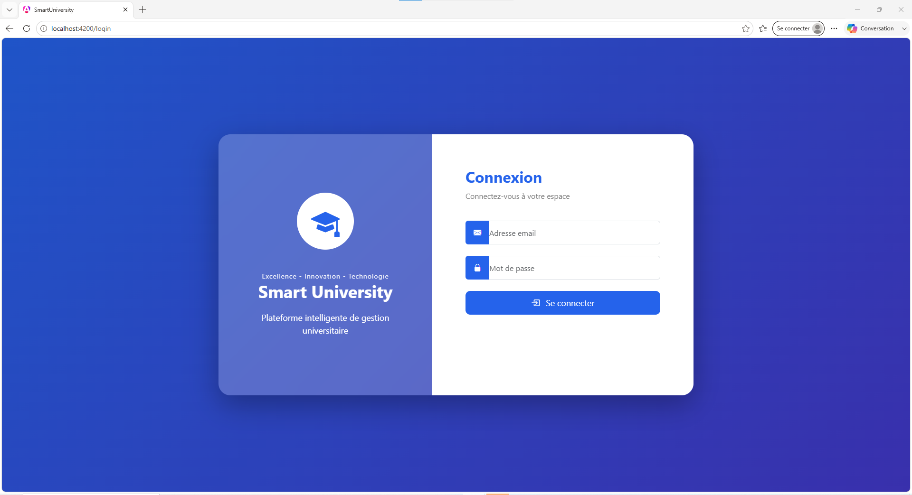

---

### 📊 Dashboard

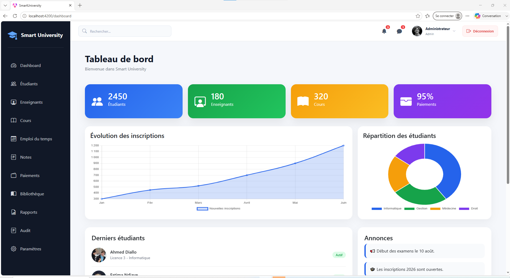

---

### 👨‍🎓 Gestion des étudiants

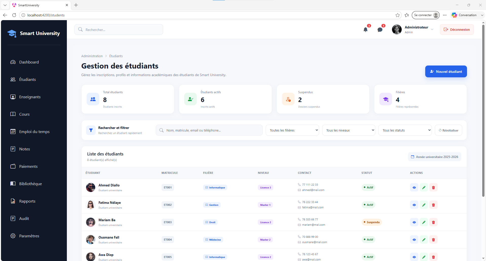

---

### 👨‍🏫 Gestion des enseignants

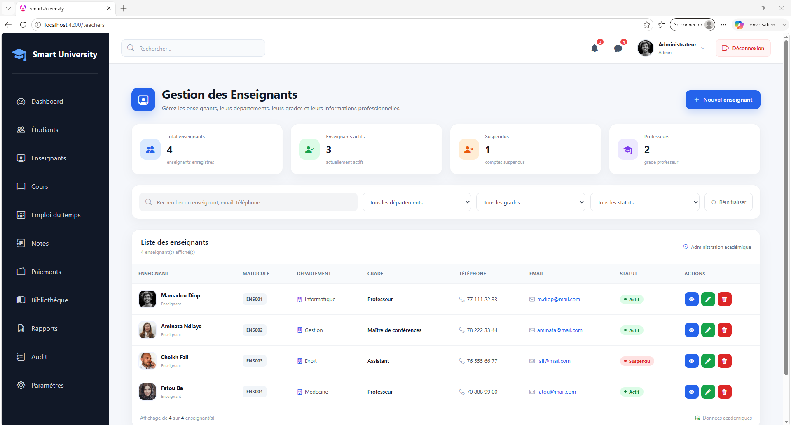

---

### 📚 Gestion des cours

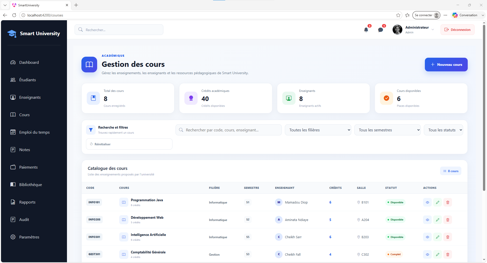

---

### 📅 Emploi du temps

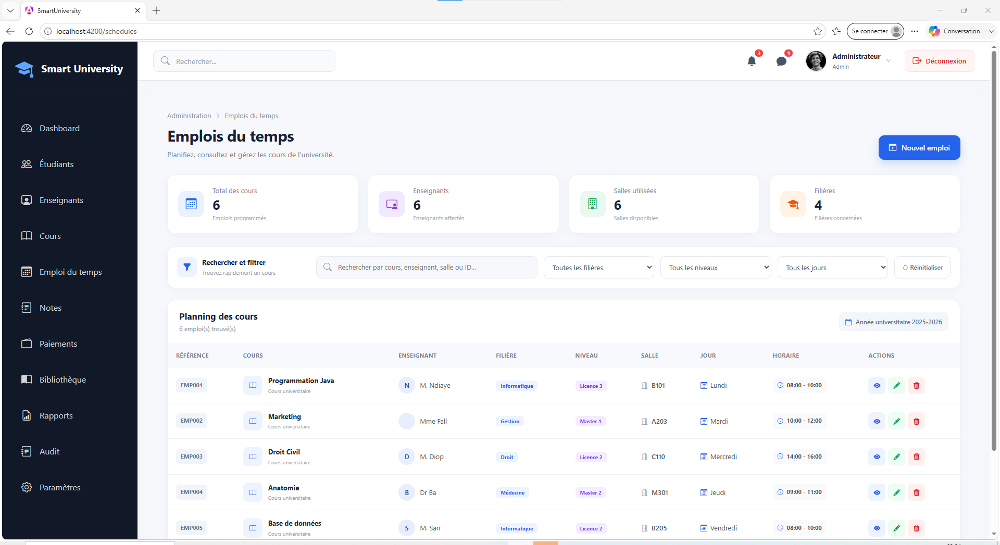

---

### 📝 Gestion des notes

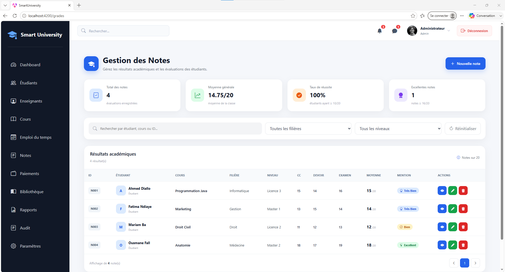

---

### 💳 Paiements

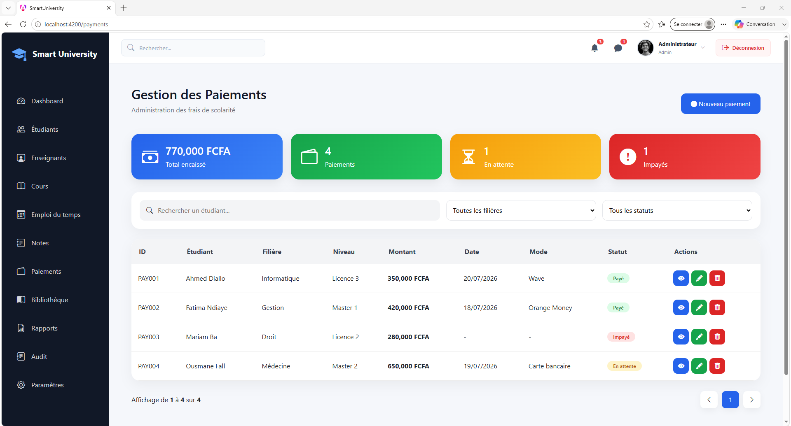

---

### 📖 Bibliothèque

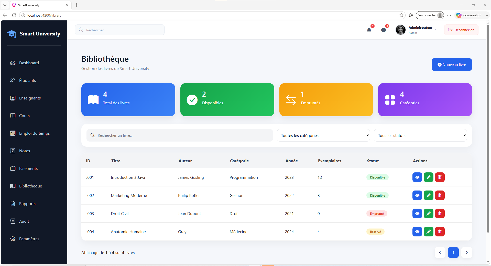

---

### 💬 Messages

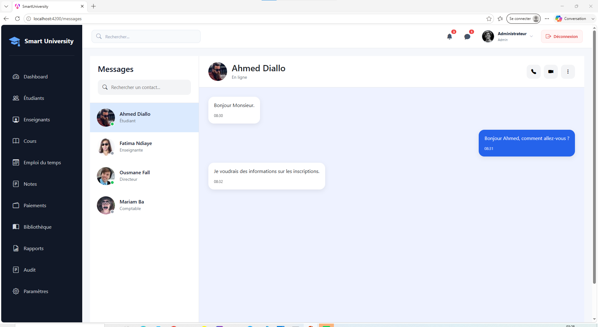

---

### 🔔 Notifications

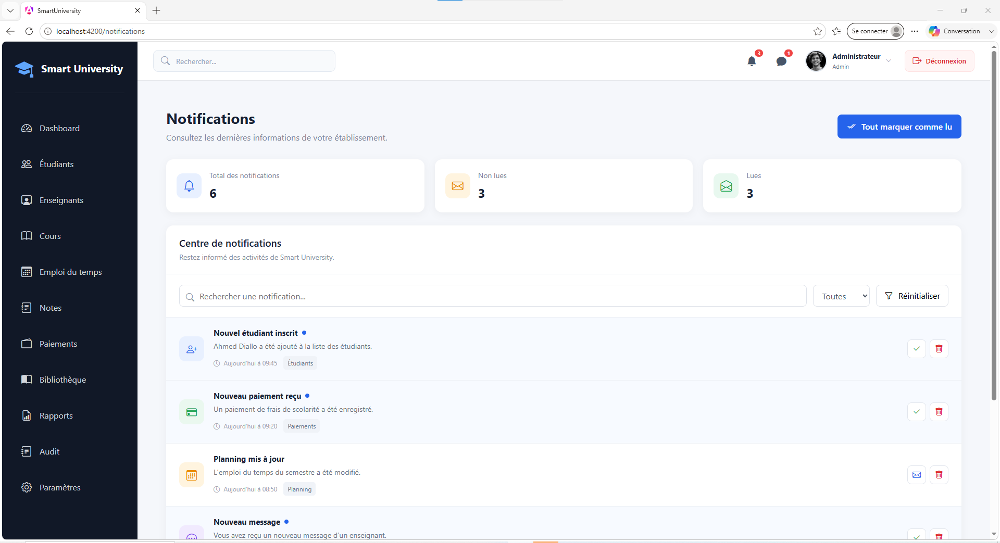

---

### 📊 Rapports

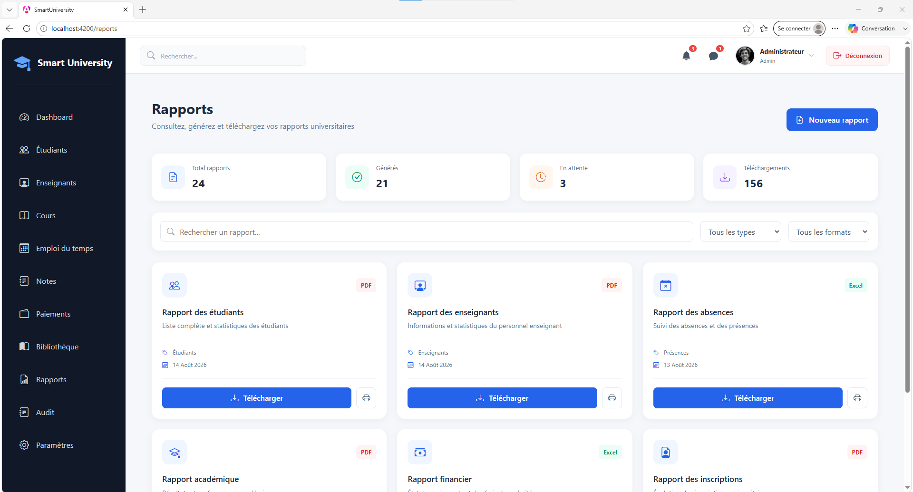

---

### 🔐 Audit

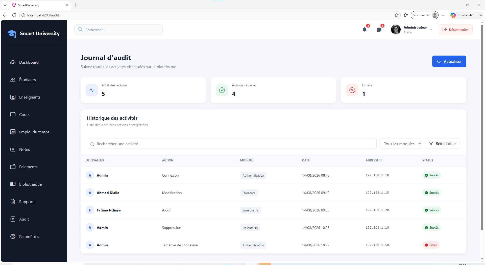

---

### 👤 Profil

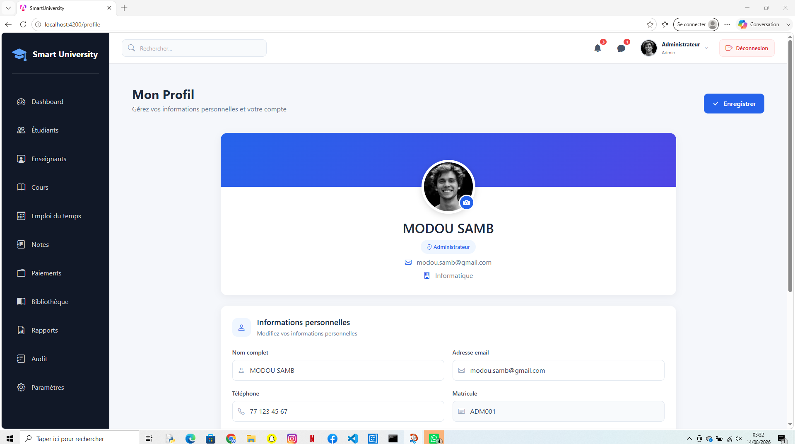

---

### ⚙️ Paramètres

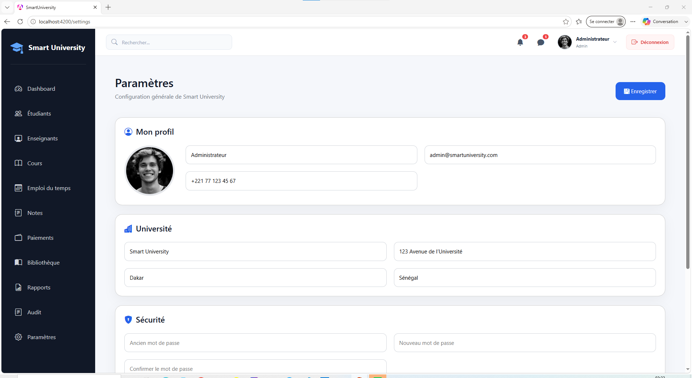

---

## 🛠️ Technologies utilisées

### Frontend

- Angular 21
- TypeScript
- HTML5
- CSS3
- Bootstrap
- Bootstrap Icons

### Gestion du projet

- Git
- GitHub
- Angular CLI

---

## 📁 Structure du projet

```text
smart-university/
│
├── src/
│   ├── app/
│   │   │
│   │   ├── guards/
│   │   │   └── auth-guard.ts
│   │   │
│   │   ├── layouts/
│   │   │
│   │   ├── pages/
│   │   │   ├── dashboard/
│   │   │   ├── students/
│   │   │   ├── teachers/
│   │   │   ├── courses/
│   │   │   ├── schedules/
│   │   │   ├── notes/
│   │   │   ├── payments/
│   │   │   ├── library/
│   │   │   ├── messages/
│   │   │   ├── notifications/
│   │   │   ├── profile/
│   │   │   ├── settings/
│   │   │   ├── reports/
│   │   │   └── audit/
│   │   │
│   │   └── shared/
│   │
│   ├── styles.css
│   └── main.ts
│
├── angular.json
├── package.json
├── tsconfig.json
└── README.md
